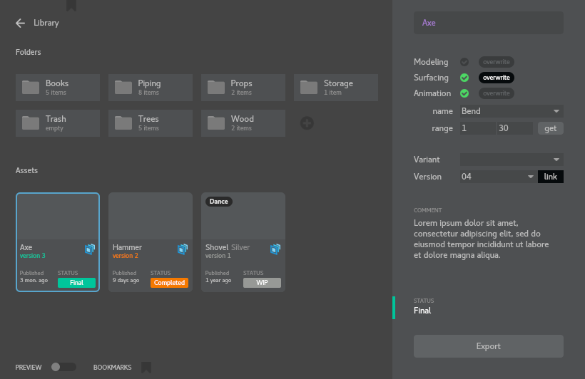

# Maya to USD Asset Exporter

Tool for exporting selected transform/mesh hierarchy from Maya scene to separated animation, modelling and surfacing "usd" layers with version control


##### Export Dialog



### Install:
Add this folder path to PYTHONPATH and run from Maya Script Editor

```python
# define library to export assets
# os.environ["ASSETLIBS"]=/server/library

from toolbox import AssetUsd
AssetUsd.Export()

import importlib
importlib.reload(AssetUsd)
```


### Tested on:

| Application       | Version        |
| ----------------- | -------------- |
| Maya              | 2022.3         |
| Python            | 3.7.7          |
| USD               | 21.08          |

Operating System: CentOS 7


### Python Requirements

The following dependencies are required:
+ [Qt.py](https://github.com/mottosso/Qt.py)
+ used oslquery module from RenderMan library ([Open Shading Language](https://github.com/AcademySoftwareFoundation/OpenShadingLanguage) python bindings)


### Limitations:
+ It’s possible to export only UsdPreviewSurface and RenderMan shader networks (including Lama)
+ Import/Render ready for Katana only


#### Documentation

+ [Library Descriptioin](doc/LibraryDescriptioin.md)
+ [Asset Descriptioin](doc/AssetDescriptioin.md)
