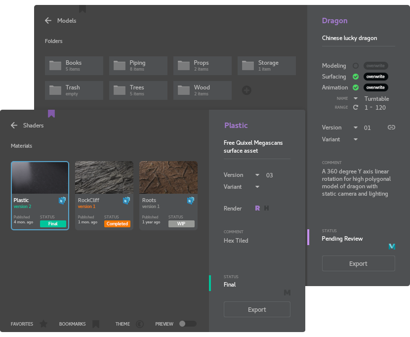

# Donor Kit
Tools for Exporting, Importing and Managing CG Assets based on USD workflow
  
#### Manager
Add description, version comment, change status, set symbolic link, load to DCC

  
#### Asset & Material Export
Export selected meshes of shading groups from Maya scene to organized USD layers with version control

  
#### Install:
+ **maya:** to install plugin add `<root>/install` location to MAYA_MODULE_PATH
+ **katana:** use `<root>/install/katana` as example to create launcher script
+ **os:** run `<root>/toolkit/system/DonorManager.py`
  
#### Tested on:

| Application  | Version |
|--------------|---------|
| Maya         | 2022.3  |
| Python       | 3.7.7   |
| USD          | 21.08   |
| RenderMan    | 24.3    |

Operating System: CentOS 7
  
#### Python Requirements (OS)
The following dependencies are required:
+ PySide2 or PyQt5
  
#### Info:
- [Naming & Hierarchy](doc/Naming.md)
- [Libraries](doc/Libraries.md)
  
#### Features:
+ Export only UsdPreviewSurface and RenderMan shader networks
+ Import/Render ready for Katana only
+ It expects to work with meter units
