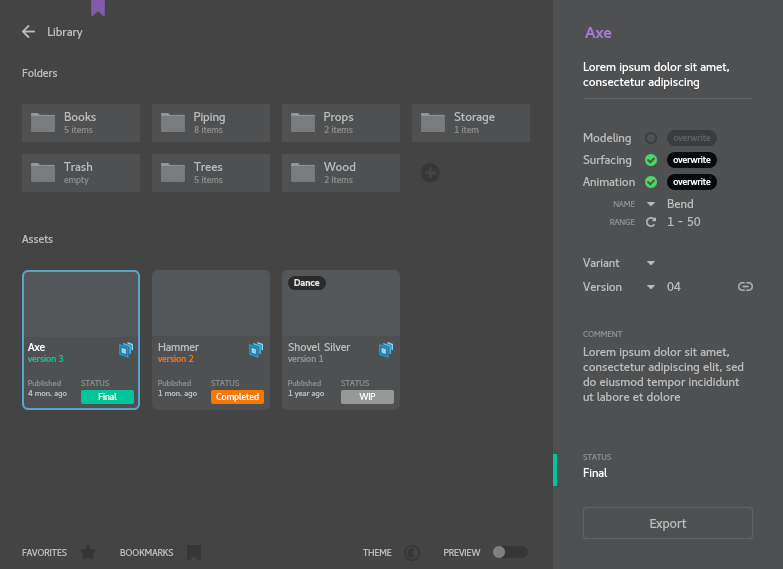

# Maya to USD Asset Exporter

Tool for exporting selected transform/mesh hierarchy from Maya scene to separated animation, modelling and surfacing "usd" layers with version control


##### Export Dialog



### Install:
Add this folder path to PYTHONPATH and run from Maya Script Editor

```python
from toolbox import AssetUsd
AssetUsd.Export()
```


### Known Limitations:
+ It’s possible to export only UsdPreviewSurface and RenderMan shader networks (including Lama)
+ Import/Render ready for Katana only


### Tested on:

| Application       | Version        |
| ----------------- | -------------- |
| Maya              | 2022.3         |
| Python            | 3.7.7          |
| USD               | 21.08          |

Operating System: CentOS 7


#### Documentation

+ [Asset Descriptioin](doc/AssetDescriptioin.md)
