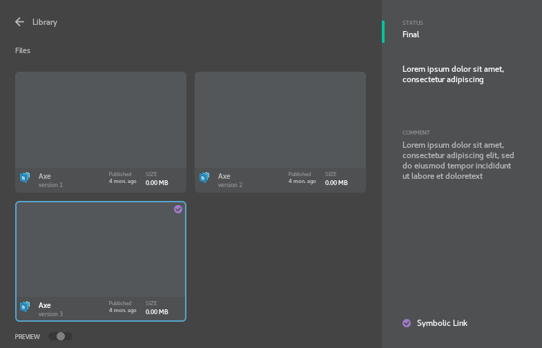

# Donor Manager
Add description, version comment, change status,
set symbolic link, load to DCC
  

  
#### Install:
+ **maya:** to install plugin add `<root>/install` location to MAYA_MODULE_PATH
+ **katana:** use `<root>/install/katana` as example to create launcher script
+ **os:** run `<root>/toolkit/system/DonorManager.py`
  
#### Tested on:

| Application | Version |
|-------------|---------|
| Python      | 3.7.7   |
| USD         | 21.08   |

Operating System: CentOS 7
  
#### Python Requirements (OS)
The following dependencies are required:
+ PySide2 or PyQt5