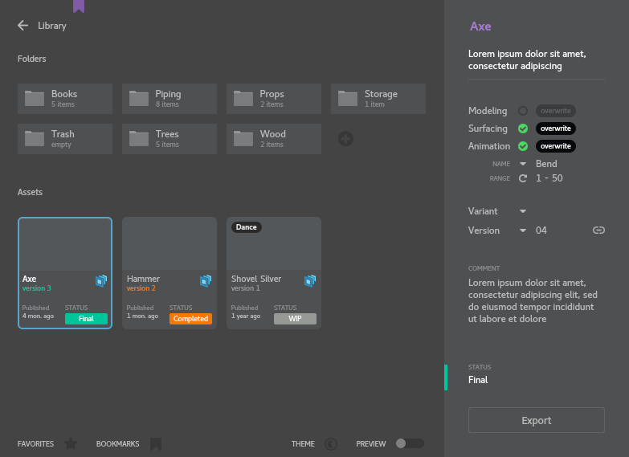

# Maya to USD Asset Export
Tool for exporting selected transform/mesh hierarchy
from Maya scene to separated animation, modelling
and surfacing "usd" layers with version control
  

  
#### Install:
To install plugin add `<root>/install` location to MAYA_MODULE_PATH
  
#### Tested on:

| Application  | Version |
|--------------|---------|
| Maya         | 2022.3  |
| Python       | 3.7.7   |
| USD          | 21.08   |
| RenderMan    | 24.3    |

Operating System: CentOS 7
  
#### Limitations:
+ Export only UsdPreviewSurface and RenderMan shader networks
+ Import/Render ready for Katana only